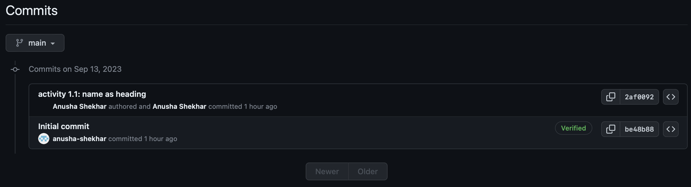

# Anusha Shekhar

## Activity 1: Creating a repo in your own GitHub account and committing files
- My name is a heading in this markdown file
- A screenshot of the commit on GitHub is provided below

## Activity 2: Branching and merging
- A branch named "develop" was created
- The file "helloworld.py" in this repository prints "Hello World" to the terminal