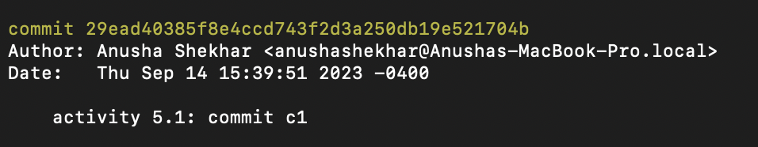
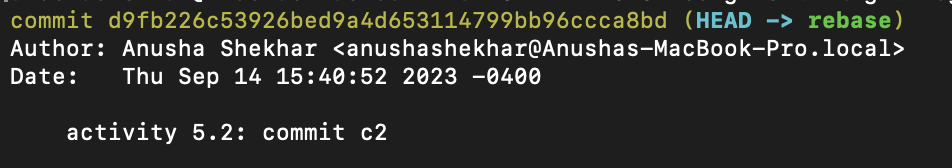
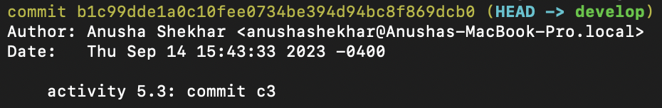
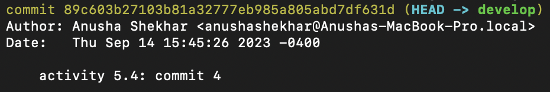
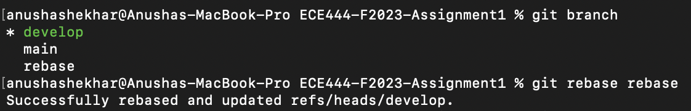
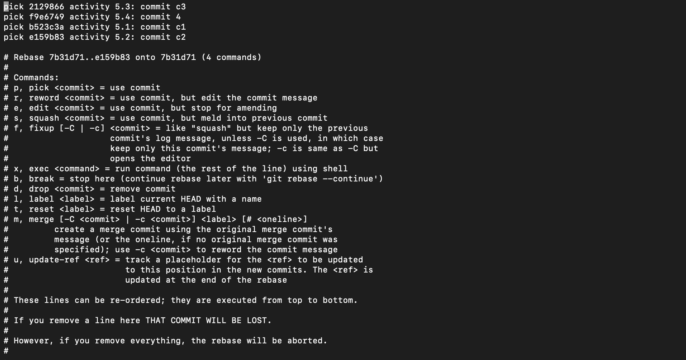
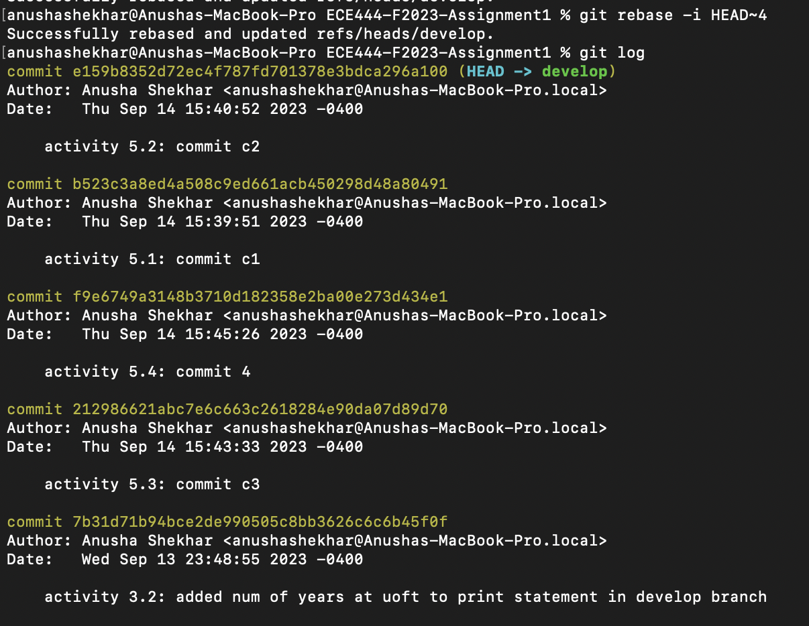
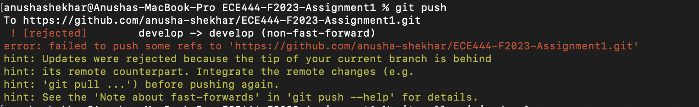
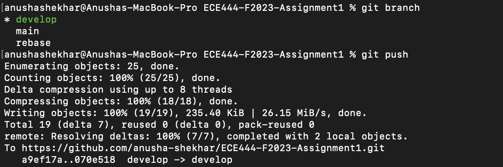
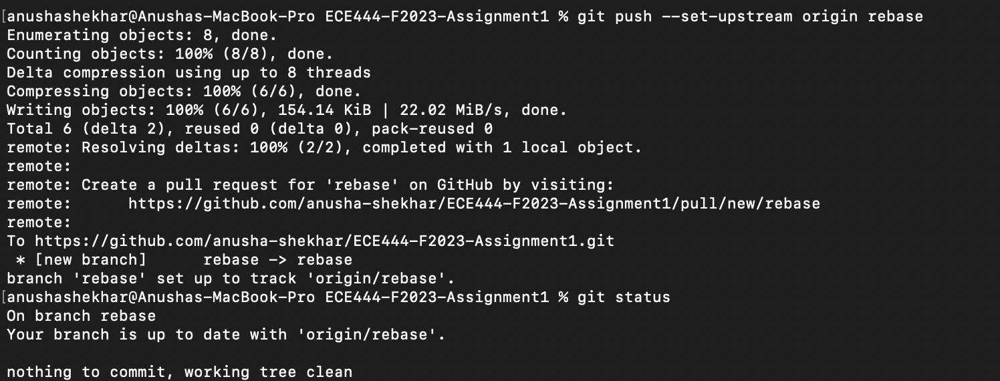

# Anusha Shekhar

## Activity 1: Creating a repo in your own GitHub account and committing files
- My name is a heading in this markdown file
- A screenshot of the commit on GitHub is provided below

## Activity 2: Branching and merging
- A branch named "develop" was created
- The file "helloworld.py" was created in the develop branch to print "Hello World" to the terminal
- The changes were merged into the main branch
- A screenshot of the output of the merge command is provided below

## Activity 3: Issues, pull requests and merge conflicts
- An issue has been created about adding how many years I have been at UofT
- On the main branch, "helloworld.py" now prints my name
- On the develop branch, "helloworld.py" now prints the number of years I have been at UofT
- A pull request was created, the issue created above was linked, and the merge conflicts were resolved
- A screenshot of the successful merge is provided below
  

## Activity 4: Unit test
- The utlis class has been created in utils.py with functions named reversed and formatter
- A screenshot of the sucessful commit is provided below:

- A test_utils class has been created in utils_test.py with unit tests 

## Activity 5: Git rebase
- A rebase branch was created from the develop branch
- Commits c1 and c2 were made on the rebase branch:

- Commits c3 and c4 were made on the develop branch:

- Branch 'rebase' was rebased into branch 'develop' to get order of commits c1->c2->c3->c4

- The order of commits in the develop branch was changed to c3->c4->c1->c2 using the interactive rebase tool:

- The commits are now in the requried order:

- The develop branch was pushed after resolving some conflicts:

- The rebase branch was pushed:
